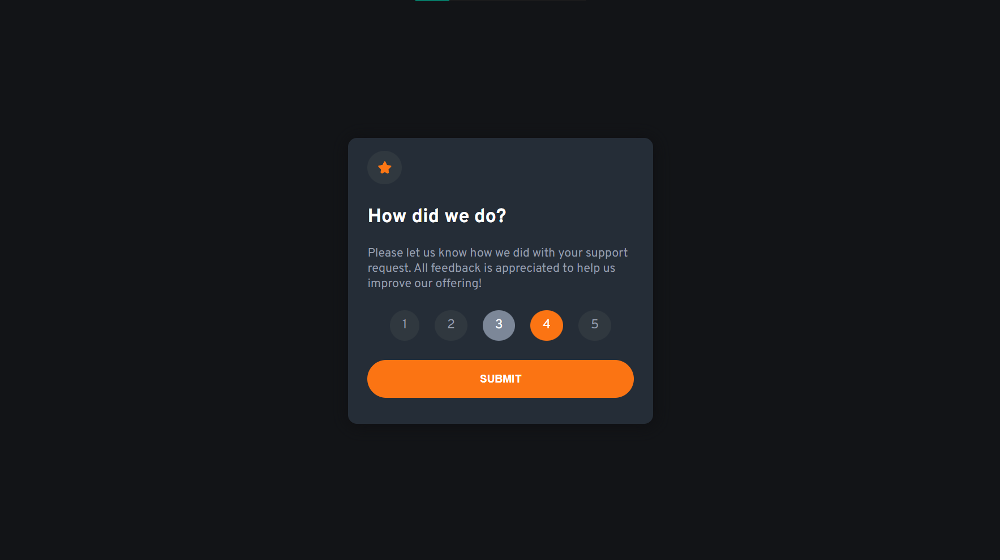
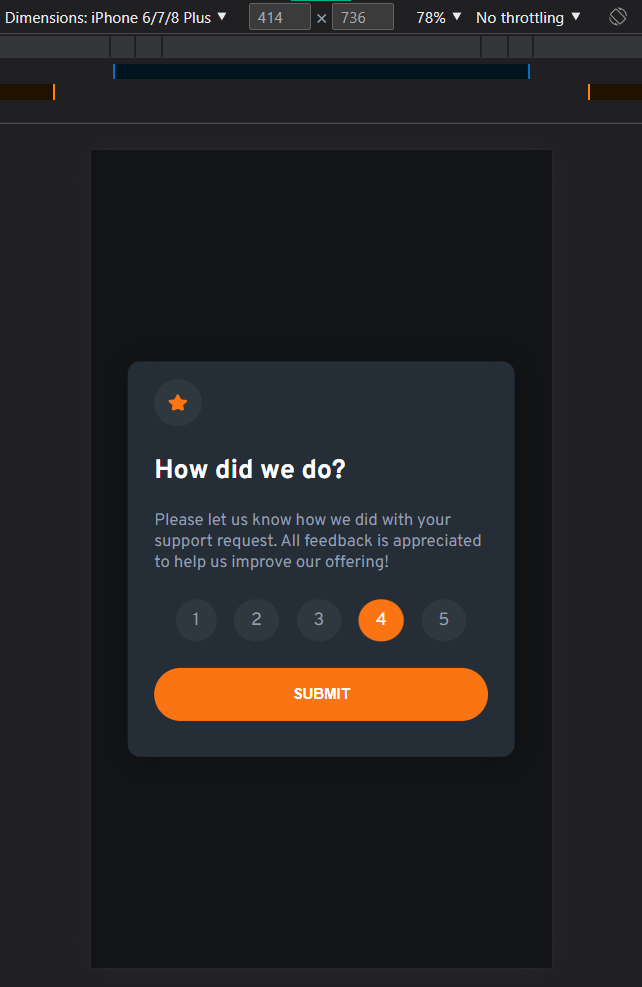
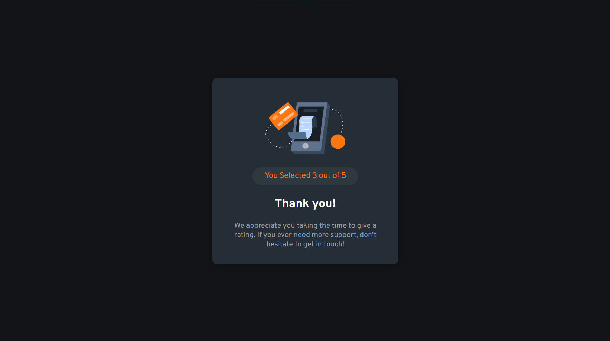
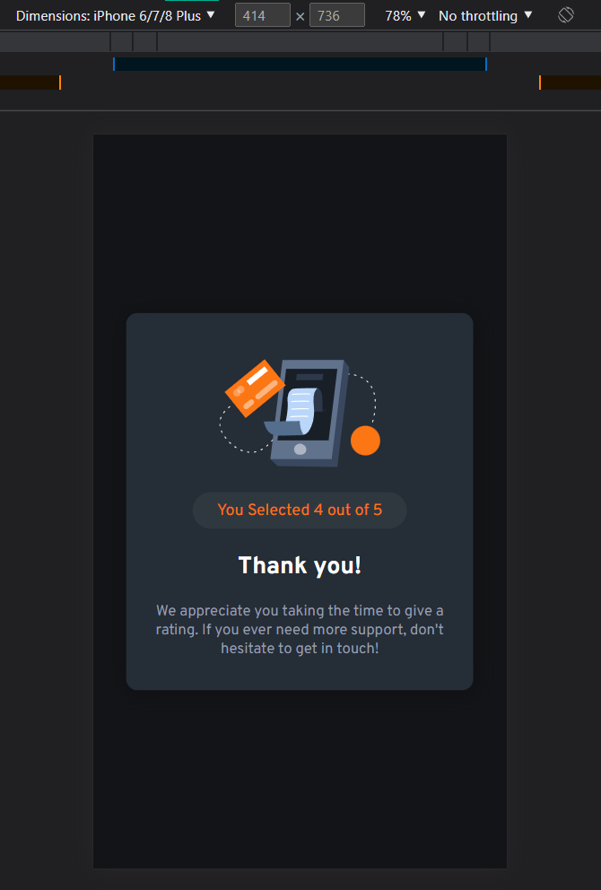

# Frontend Mentor - Interactive Rating Component Solution

This is a solution to the [Interactive rating component challenge on Frontend Mentor](https://www.frontendmentor.io/challenges/interactive-rating-component-koxpeBUmI). <br>
Frontend Mentor challenges help you improve your coding skills by building realistic projects. 

## Table of contents

- [Overview](#overview)
  - [The challenge](#the-challenge)
  - [Screenshot](#screenshot)
  - [Links](#links)
- [My process](#my-process)
  - [Built with](#built-with)
  - [What I learned](#what-i-learned)
  - [Continued development](#continued-development)
- [Author](#author)
- [Acknowledgments](#acknowledgments)


## Overview

### The challenge

Users should be able to:

- View the optimal layout for the app depending on their device's screen size
- See hover states for all interactive elements on the page
- Select and submit a number rating
- See the "Thank you" card state after submitting a rating

### Screenshot

| Desktop View | Mobile View |
|---------|---------|
|  |  |
|  |  |

### Links
- Live Site URL: [Website Link - Click Me](https://interactive-rating-component-hazel-iota.vercel.app/)
- Solution URL: [FrontEndMentor Link](https://your-solution-url.com)

## My process

### Built with
- Plain: HTML, CSS, and Javascript 
- Mobile-first workflow

### What I learned

Recap over some of the major learnings while working through this project:
- Basic review of HTML & CSS
- CSS Flex Layout
- Basics of JS (Implementing what I had learned)
- Basics of DOM Manipulation
- Some shortcuts in coding javascript (Eg. Arrow Function, ForEach Loop, Backtick Syntax, etc.)

<br>

This code snippets/function, if what I'm proud to accomplished:

```js
function rateClick() {
  const btn = document.querySelectorAll(".rating-btn");
  btn.forEach(function (button, index) {
    button.addEventListener('click', () => {
      // Remove active class from all buttons
      btn.forEach(b => b.classList.remove('active'));
      // Add active class to clicked button
      button.classList.add('active');
      // Count & Update num. of .rating-btn with active class.
      btnActive = document.querySelectorAll('.rating-btn.active').length;
      // For Debugging
      console.log(`Button Clicked: ${index + 1}\n`);
      console.log(`Active:Btn Length: ${btnActive}\n`);
      btnSelected = index + 1;
      //Check for condition, after toggle.
      submitClickChecker();
    })
  })
}
```

### Continued development
<hr>

#### Here are a few possible areas that could be added or improved in the HTML and CSS code you provided:
1. **Accessibility:** - It could be more accessible to users with disabilities by:
    - Include appropriate ARIA attributes, alt text, and semantic HTML tags. 
    - Also, providing a larger font size, better color contrast, and using aria-label, aria-roles attributes for the interactive elements.
2. **Responsiveness:** - Using responsive design techniques and media queries for different screen sizes and devices .
3. **User Experience:** - User experience could be improved by: 
    - Making the rating process more intuitive and visually appealing. 
    - Providing a more prominent hover effect on the rating button, 
    - Making the submit button more obvious, 
    - And providing more clear and prominent feedback after the user submits the rating.
4. **Error handling:** - Adding error handling in case a user doesn't select any rating or if they forget to submit the rating.
5. **Validation:** - Adding validation to the form, to make sure that the user has selected a rating before submitting.
6. **Store the data:** - Adding functionality to store the data of the rating, so that it can be used for further analysis.
7. **Security:** - Adding security measures to protect against cross-site scripting (XSS) and cross-site request forgery (CSRF) attacks.
8. **Optimization:** - It would be more efficient by reducing the number of media queries and removing unused CSS rules.

<br>

_Provided by ChatGPT3_

## Author
- Github - [@Iron-Mark](https://github.com/Iron-Mark)
- Frontend Mentor - [@Iron-Mark](https://www.frontendmentor.io/profile/Iron-Mark)

## Acknowledgments
- I would like to acknowledge the hard work and dedication that I went into creating this website. 
- I am grateful for my friend to those who motivate me push through my expertise and bring this project to fruition. 
- I hope that this website serves its intended purpose. Thank you.
